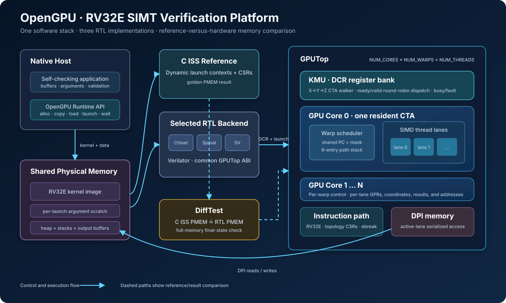

# OpenGPU

OpenGPU is a compact, parameterized SIMT GPU research and verification platform. It implements the same RV32E execution model in Chisel, SpinalHDL, and SystemVerilog, and connects every implementation to a shared native runtime, physical-memory model, Verilator harness, and C instruction-set simulator (ISS).

The project is intended for architecture experiments, RTL education, and backend equivalence testing. It is a simulation-oriented design rather than a production GPU: kernels run on a small RV32E ISA, memory is provided through DPI, and the current hardware flow targets Verilator.



## Highlights

- Three independently maintained RTL backends with a common `GPUTop` interface
- Configurable numbers of cores, resident warps, and threads per warp
- Per-lane program counters and 16 RV32E integer registers
- Round-robin warp scheduling with PC-based lane masking for divergent control flow
- Native C/C++ runtime for allocation, transfers, kernel loading, launch, and synchronization
- C ISS reference execution and optional full-PMEM DiffTest against RTL
- VCD waveform generation and instruction/store tracing
- Self-checking tests for arithmetic, topology, work sizes, and divergence

## Quick start

Check that the required tools are available:

```sh
scripts/setup.sh check
```

Select the SystemVerilog backend and run the default `vecadd` test:

```sh
make gpu_verilog_defconfig
make run
```

A successful run ends with output similar to:

```text
[DIFF] C ISS and Core RTL PMEM match
[HOST] vecadd n=35: PASS
```

Run another test by name:

```sh
make run TEST=divergence
make run TEST=topology
```

## How it works

The host application uses the public runtime API to allocate device memory, upload data, load a kernel image, and launch it. For a hardware backend, the runtime snapshots PMEM, executes the kernel with the C ISS, restores the snapshot, and then runs the selected RTL through Verilator. When DiffTest is enabled, the complete final PMEM images are compared.

Inside each GPU core, a round-robin scheduler selects an active warp. Lanes in that warp whose program counter matches the selected instruction form the issue mask; lanes on another control-flow path remain inactive until their PC is selected. Loads and stores are issued lane by lane through the shared DPI memory interface. A lane halts on `ebreak`, and a core reports completion after all resident lanes halt.

```mermaid
flowchart TB
    repo[OpenGPU]

    repo --> hw[hw/ — RTL implementations]
    hw --> chisel[chisel/ — Chisel sources and Scala builds]
    hw --> spinal[spinal/ — SpinalHDL sources and Scala builds]
    hw --> verilog[verilog/ — SystemVerilog sources and DPI]
    hw --> hwbuild[build/ — generated RTL, Verilator objects, waves]

    repo --> sw[sw/ — software stack]
    sw --> api[include/ — public host runtime API]
    sw --> runtime[runtime/ — runtime, PMEM, C ISS, RTL harness]
    sw --> kernel[kernel/ — RV32E ABI, startup code, linker script]
    sw --> launcher[launcher.cpp — native frontend entry wrapper]

    repo --> tests[tests/ — kernels and host-side checkers]
    tests --> cases[vecadd · vecsub · bitxor · sizes · topology · divergence]

    repo --> configs[configs/ — reproducible Kconfig presets]
    repo --> scripts[scripts/ — setup and RTL build rules]
    repo --> tools[tools/ — Kconfig and dependency utilities]

    classDef generated fill:#fff3cd,stroke:#b58105,color:#4b3600;
    class hwbuild generated;
```



## Backends and configuration

| Backend | Configuration | Scala build tool |
| --- | --- | --- |
| SystemVerilog | `make gpu_verilog_defconfig` | Not required |
| Chisel | `make gpu_chisel_defconfig` | `TOOL=mill` or `TOOL=sbt` |
| SpinalHDL | `make gpu_spinal_defconfig` | `TOOL=mill` or `TOOL=sbt` |
| C ISS only | `make gpu_sm_defconfig` | Not required |

For example:

```sh
make gpu_chisel_defconfig
make TOOL=mill run

make gpu_spinal_defconfig
make TOOL=sbt run
```

`gpu_hm_defconfig` is retained as a compatibility alias for the Chisel hardware model. A backend can also be overridden for one command without changing `.config`:

```sh
make BACKEND=spinal TOOL=mill rtl
make BACKEND=verilog verilate
```

Use `make menuconfig` to select the frontend, software or hardware model, HDL, build tool, trace options, and topology. `GPU_NUM_WARPS` and `GPU_NUM_THREADS` must be powers of two; the supported configurable range for each topology dimension is 1–64.

## Build targets

The root `Makefile` is the main entry point:

| Command | Purpose |
| --- | --- |
| `make build` or `make runtime` | Build the native runtime library |
| `make rtl` | Generate or select RTL for the configured backend |
| `make verilate` | Build the Verilator static library |
| `make run TEST=vecadd` | Build and run one self-checking kernel test |
| `make wave TEST=vecadd` | Run a test and open `hw/build/wave.vcd` in GTKWave |
| `make menuconfig` | Interactively edit the project configuration |
| `make clean-all` | Remove generated project build products |

Individual layers also expose development entry points:

```sh
make -C hw BACKEND=verilog verilate
make -C sw BACKEND=verilog runtime
make -C tests/vecadd run
```

Generated files live under `hw/build/`, `sw/build/`, and test-local `build/` directories.

## Runtime and kernel ABI

The public host interface is declared in [`sw/include/runtime.h`](sw/include/runtime.h). Its `gpu_` API covers device lifecycle, configuration queries, memory allocation and transfer, kernel loading, launch, wait, and error reporting.

Kernel support is located in [`sw/kernel`](sw/kernel). Kernels are built for the `riscv32-gpu` target and use the launch metadata placed in PMEM by the runtime. Logical hart IDs map directly onto the configured topology:

```text
mhartid = core_id * NUM_WARPS * NUM_THREADS
         + warp_id * NUM_THREADS
         + thread_id
```

All RTL backends expose the same top-level contract:

- `io_gpu_launch`, `io_gpu_busy`, and per-core `io_gpu_done`
- Per-warp activity state
- The currently issued warp and lane mask for each core
- DPI-backed instruction and data memory access

The kernel image begins at `0x81000000`; launch metadata and arguments occupy reserved addresses immediately above the image region. These internal values are defined in `sw/runtime/gpu/include/gpu.h` and enforced by the GPU linker script.

## Tests and debugging

Available tests are `vecadd`, `vecsub`, `bitxor`, `sizes`, `topology`, and `divergence`. Each test contains a native host checker, shared launch arguments, and an RV32E kernel. See [`tests/README.md`](tests/README.md) for case-by-case coverage.

Enable instruction and store traces for a bounded number of events:

```sh
make run TEST=divergence GPU_TRACE=1 GPU_TRACE_LIMIT=200
```

Waveform generation, DiffTest, and the VCD cycle window can be adjusted with `make menuconfig`.

## Requirements

The build expects GNU Make, GCC/G++, Java, Flex, Bison, Verilator, GTKWave, and the `riscv64-linux-gnu-*` cross-toolchain. The Scala backends use Scala 2.13.12, ScalaTest 3.2.19, Mill 1.1.2 or SBT 1.10.7; Chisel uses 6.7.0 and SpinalHDL uses 1.12.0.

`scripts/setup.sh` provides `check`, `deps`, `java`, `mill`, `sbt`, `verilator`, `gtkwave`, `toolchain`, and `all` commands. Review the script before using its installation commands because they install system packages and tools.

## Current scope

- Native host execution is implemented; the RISC-V and MIPS host frontends are placeholders.
- RTL simulation is the supported hardware path; FPGA synthesis and physical implementation flows are not included.
- The core implements the RV32E integer subset required by the included kernels, with `mhartid` support and `ebreak` termination. Unsupported instructions halt the affected lane.
- The memory system is a flat simulated PMEM reached through DPI; caches, virtual memory, and a production interconnect are outside the current design.

## License

OpenGPU is released under the [MIT License](LICENSE). Some imported build utilities retain their own license notices; test material under `tests/` includes its corresponding license file.
